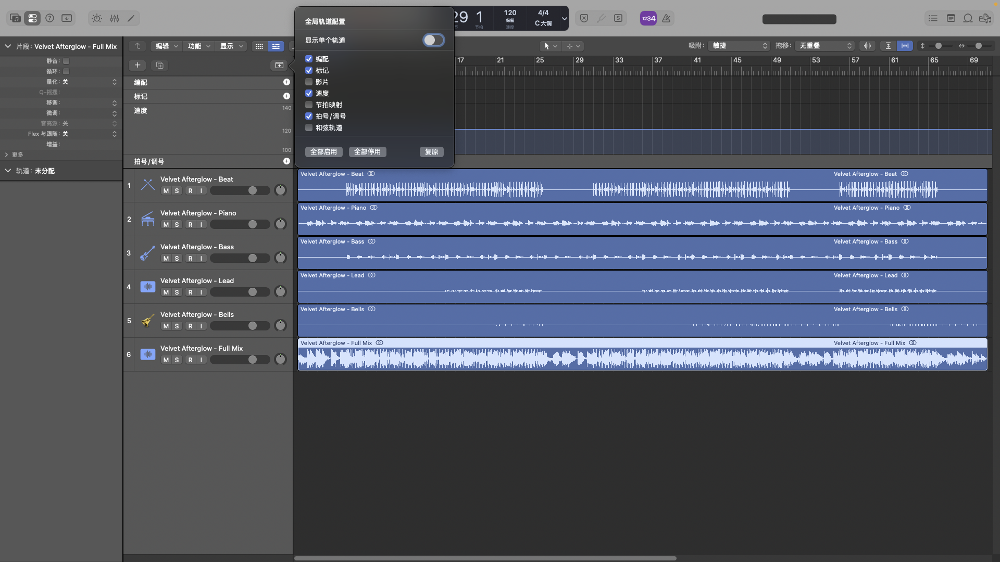

# Logic Loop Arranger

[](./LICENSE)


`Logic Loop Arranger` is an open-source Codex skill for creating accompaniment in Logic Pro with Apple Loops.

It is designed to act less like a generic assistant and more like a top-tier music producer:
- it starts by narrowing taste
- it translates vague creative language into production decisions
- it helps shape arrangement, structure, and delivery targets
- it prepares a Logic-friendly handoff instead of pretending Logic has a full external API

This repository is intentionally focused on accompaniment.

It does not target:
- lyric writing
- topline melody writing
- vocal synthesis
- deep plugin automation inside Logic Pro

## Project status

This project is an early, focused OSS skill rather than a full DAW automation toolkit.

The stable surface today is:
- the Codex skill definition in [SKILL.md](SKILL.md)
- producer-intake and arrangement references
- repeatable producer-brief generation through [scripts/create_producer_brief.py](scripts/create_producer_brief.py)
- repeatable Logic handoff notes through [scripts/create_delivery_notes.py](scripts/create_delivery_notes.py)
- stem package preparation guidance in [references/stem-package-checklist.md](references/stem-package-checklist.md)
- documentation for realistic Logic Pro handoff boundaries

The next maturity target is to grow this into a small, well-tested skill package with more genre examples, packaging helpers, and maintainer-friendly issue triage.

## Screenshot



## Why this exists

There are already useful adjacent projects for:
- Logic UI automation
- Logic Scripter examples
- MIDI scripting inside Logic

What is still missing is a practical middle layer:

an agent workflow that helps a creator move from:
- vague taste
- artist references
- mood words
- arrangement goals

to:
- a locked production brief
- a coherent Apple Loops accompaniment direction
- a clean handoff for Logic Pro

That is the gap this skill is meant to fill.

## What the skill does

- runs a producer-style creative intake
- locks a compact production brief before building
- guides Apple Loops selection and arrangement choices
- helps structure intros, verses, pre-choruses, hooks, bridges, and outros
- supports accompaniment packaging for WAV, stems, and Logic handoff
- keeps Logic automation honest and realistic

## Core idea

The skill should feel like a Grammy-level producer in the room:
- decisive
- taste-driven
- collaborative
- focused on narrowing direction before touching production

The interaction style matters as much as the technical steps.

## Why not deep Logic automation?

Because Logic Pro is a great finishing environment, but not a strong external automation target.

In practice, what works reliably is:
- preparing files outside Logic
- opening projects or assets
- importing audio or MIDI
- handling simple prompts such as sample-rate dialogs
- using Logic as the place where the creator listens, edits, arranges, and finishes

What does not work reliably as a public promise:
- full project authoring through a stable external API
- deterministic chord-track population from outside the app
- deep plugin routing or editing via UI scripting
- robust end-to-end DAW control that behaves like a real SDK

That is why this skill is intentionally designed around:
- creative intake
- producer-style direction
- accompaniment decisions
- clean asset preparation
- Logic-friendly handoff

Instead of pretending that Logic offers a full agent-ready automation surface.

## Who it is for

- songwriters building a backing track before toplining
- producers sketching Apple-Loops-based demos quickly
- artists who want a guided production brief before arranging
- Codex users who need a Logic-friendly accompaniment workflow

## Repository layout

```text
logic-loop-arranger-skill/
├── .github/
│   ├── ISSUE_TEMPLATE/
│   ├── PULL_REQUEST_TEMPLATE.md
│   └── workflows/
├── SKILL.md
├── agents/
│   └── openai.yaml
├── examples/
│   └── example-briefs.md
├── references/
│   ├── accompaniment-workflow.md
│   ├── intake-patterns.md
│   ├── logic-automation-limits.md
│   └── stem-package-checklist.md
├── scripts/
│   ├── create_delivery_notes.py
│   └── create_producer_brief.py
├── tests/
│   ├── test_create_delivery_notes.py
│   ├── test_create_producer_brief.py
│   ├── test_example_briefs.py
│   ├── test_repository_metadata.py
│   └── test_stem_package_checklist.py
├── CHANGELOG.md
├── CODE_OF_CONDUCT.md
├── CONTRIBUTING.md
├── LICENSE
├── PROMOTION.md
├── ROADMAP.md
├── SECURITY.md
├── .gitignore
└── README.md
```

## Install locally

Copy this folder into your Codex skills directory:

```bash
mkdir -p "$CODEX_HOME/skills"
cp -R logic-loop-arranger-skill "$CODEX_HOME/skills/"
```

Then trigger it with requests about:
- creating a Logic Pro accompaniment
- arranging with Apple Loops
- extending or refining a backing track
- preparing stems and Logic-ready delivery assets

## Quick start

Examples of the kinds of prompts this skill should handle well:

- “Help me build a slow R&B accompaniment in Logic with Apple Loops.”
- “I want a late-night pop/R&B backing track, more SZA than glossy radio.”
- “Turn this vague mood into a producer brief before we arrange anything.”
- “Expand this Apple Loops beat into a full song structure and prep stems for Logic.”

For sample creative briefs, see [examples/example-briefs.md](examples/example-briefs.md).

## Producer brief helper

The repository includes a small standard-library Python helper for creating a reusable production brief:

```bash
python3 scripts/create_producer_brief.py \
  --title "Night Drive Demo" \
  --style "contemporary alt-R&B accompaniment" \
  --mood "late-night, intimate, unresolved" \
  --references "SZA, Brent Faiyaz" \
  --tempo "92-98 BPM" \
  --key "D minor" \
  --harmony "moody minor loop with restrained lift" \
  --palette "soft drums, warm keys, sub bass, sparse texture" \
  --finish "songwriting demo" \
  --deliverable "stereo WAV, stems, and Logic import notes" \
  --out producer-brief.txt
```

## Logic delivery notes helper

Use the delivery notes helper when you need a Logic-friendly handoff note for stems, section timing, and import boundaries:

```bash
python3 scripts/create_delivery_notes.py \
  --title "Night Drive Demo" \
  --tempo "92-98 BPM" \
  --key "D minor" \
  --section "Intro: 0:00-0:08, keys and texture only" \
  --section "Hook: 0:33-0:49, wider drums and bass commitment" \
  --stem "Night Drive Demo - Drums.wav" \
  --stem "Night Drive Demo - Bass.wav" \
  --stem "Night Drive Demo - Music.wav" \
  --out logic-delivery-notes.md
```

## Development checks

Run the local checks before opening a pull request:

```bash
python3 -m compileall scripts tests
python3 -m unittest discover -s tests
```

## Maintainer docs

The repository includes the standard OSS project docs expected by contributors and downstream users:

- [CONTRIBUTING.md](CONTRIBUTING.md)
- [CODE_OF_CONDUCT.md](CODE_OF_CONDUCT.md)
- [SECURITY.md](SECURITY.md)
- [CHANGELOG.md](CHANGELOG.md)
- [ROADMAP.md](ROADMAP.md)
- [PROMOTION.md](PROMOTION.md)

## Bundled assets

### References

- [references/intake-patterns.md](references/intake-patterns.md)
  Producer-style intake prompts and ambiguity-reduction patterns

- [references/accompaniment-workflow.md](references/accompaniment-workflow.md)
  Loop selection, arrangement, export, and packaging heuristics

- [references/logic-automation-limits.md](references/logic-automation-limits.md)
  Honest guidance on what Logic Pro can and cannot be automated reliably

- [references/stem-package-checklist.md](references/stem-package-checklist.md)
  Practical checklist for aligned stems, naming, source loops, arrangement maps, and Logic-ready handoff checks

### Script

- [scripts/create_producer_brief.py](scripts/create_producer_brief.py)
  A small helper for turning a locked direction into a reusable brief file

- [scripts/create_delivery_notes.py](scripts/create_delivery_notes.py)
  A small helper for turning section maps and stem expectations into Logic handoff notes

## Design principles

- Producer-first interaction
- Minimal but high-value questions
- Taste translation before execution
- Coherent loop-family selection over random stacking
- Deterministic packaging where possible
- Honest boundaries around Logic Pro automation

## Current scope

This repository is a strong open-source foundation for:
- interactive accompaniment direction
- producer-style workflow scaffolding
- repeatable handoff thinking for Logic Pro sessions

It is not yet a full automation toolkit for authoring Logic sessions.

## Roadmap ideas

See [ROADMAP.md](ROADMAP.md).

## Contributing

Contributions are welcome when they keep the project focused on accompaniment workflows and honest Logic Pro boundaries.

Start with [CONTRIBUTING.md](CONTRIBUTING.md), then use the issue templates for bug reports, workflow gaps, and feature proposals.

For responsible public sharing, see [PROMOTION.md](PROMOTION.md).

For vulnerability or safety-related reports, see [SECURITY.md](SECURITY.md).

## License

MIT
